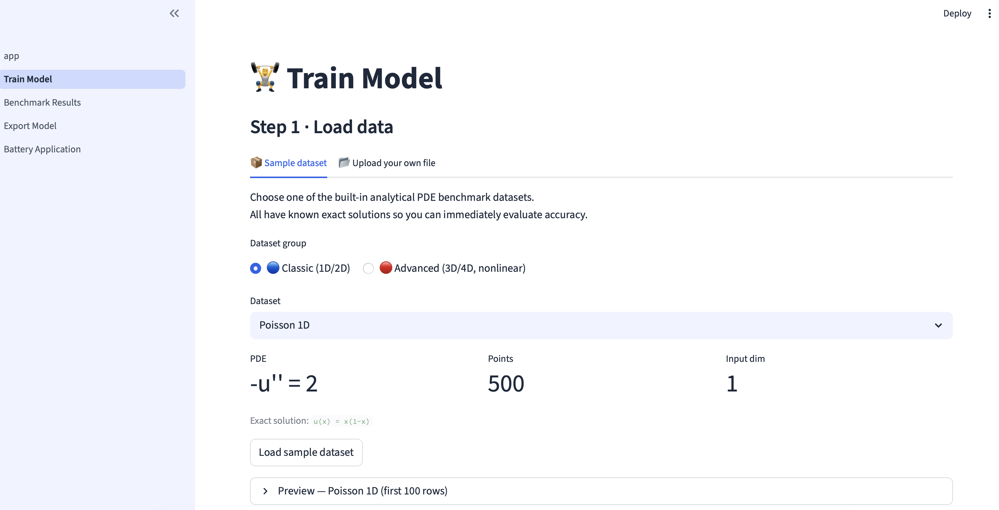
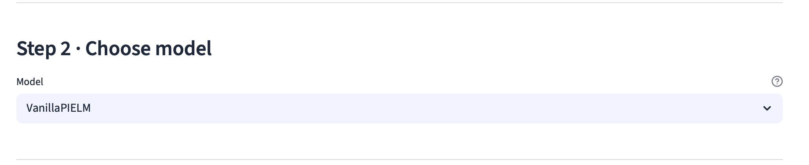
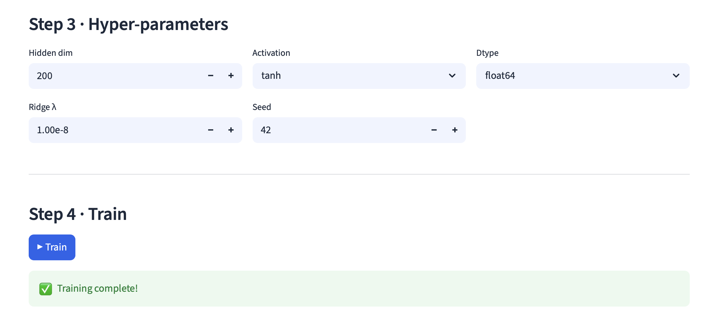
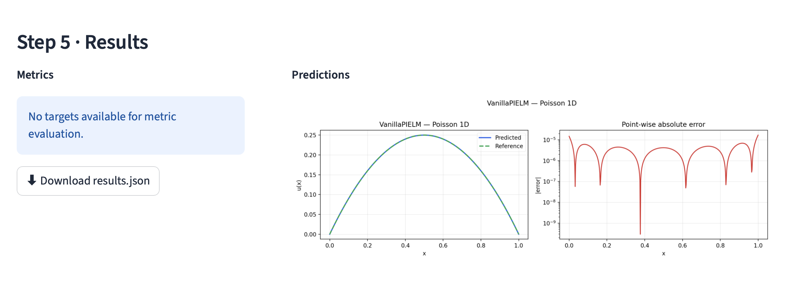
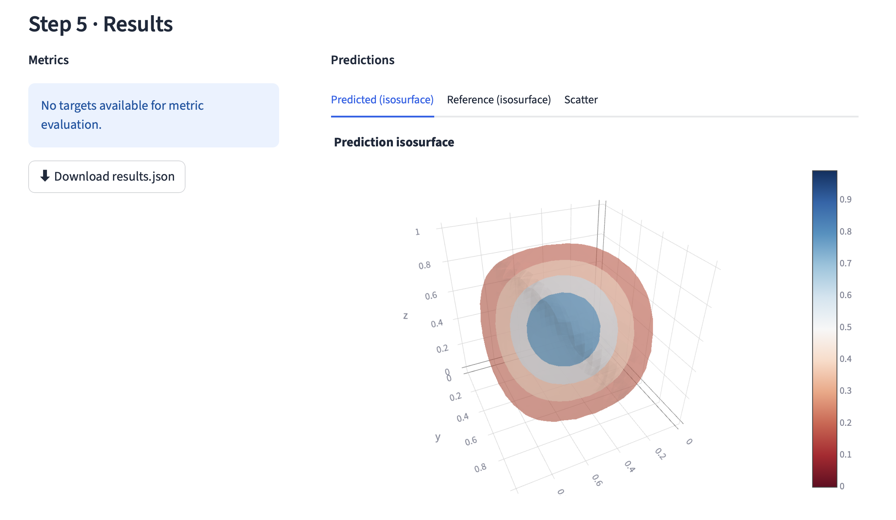
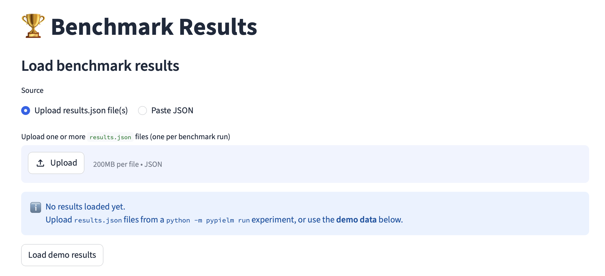
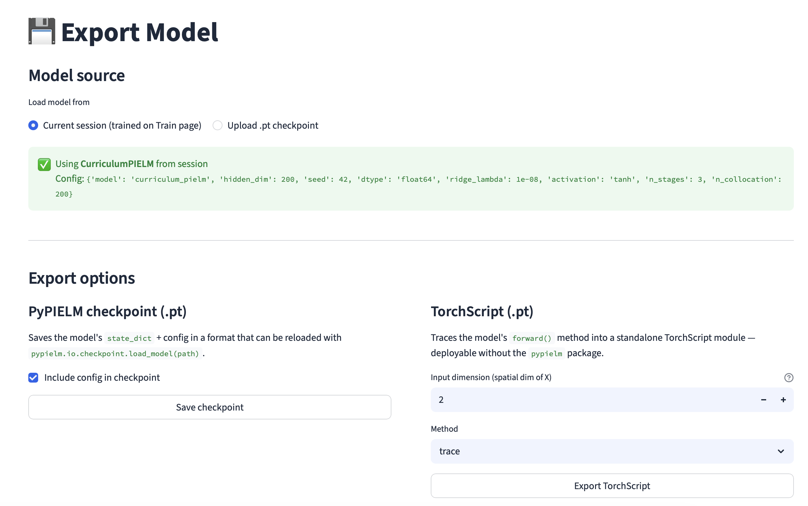
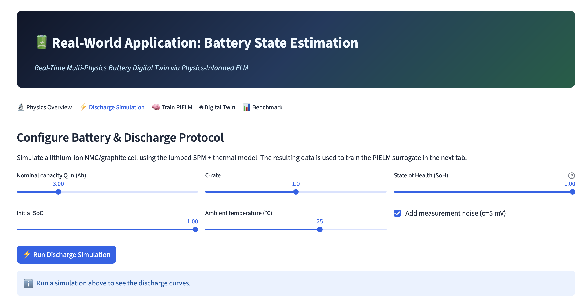
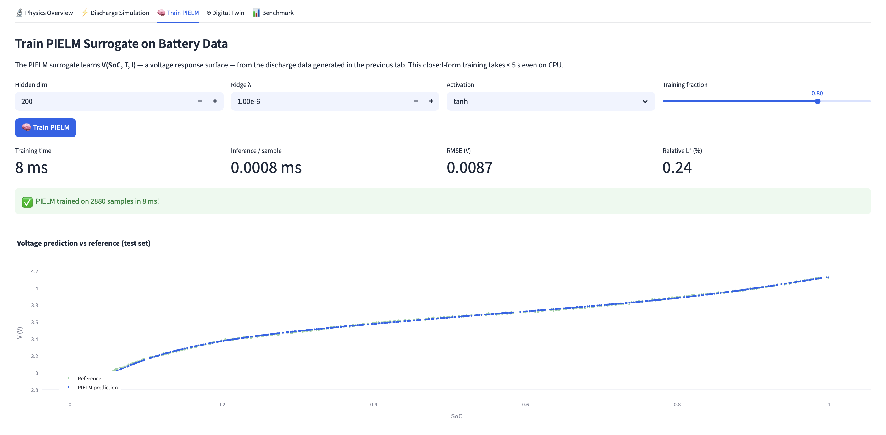
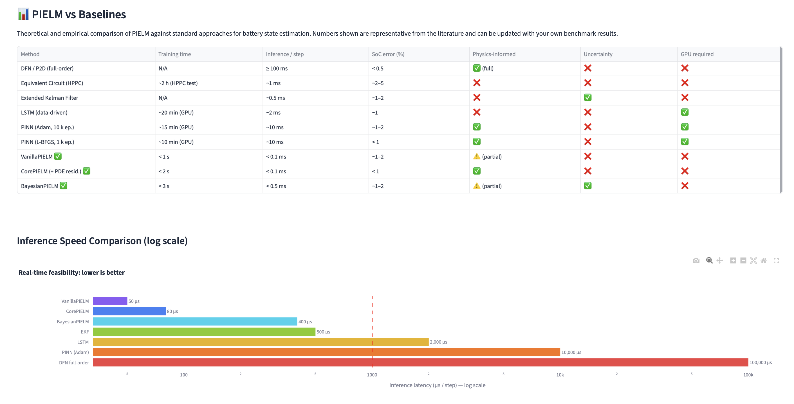

# PyPIELM App

Streamlit web frontend for the [PyPIELM](https://github.com/KStruniawski/pypielm) library —
a Physics-Informed Extreme Learning Machine framework for solving PDEs.

## Features

| Page | Description |
|------|-------------|
| 🏠 Home | Overview and quick-start |
| 🏋️ Train Model | Upload data → pick model → train → visualise predictions |
| 🏆 Benchmark Results | Compare models across PDE tasks with interactive leaderboard |
| 💾 Export Model | Export trained models to PyPIELM checkpoint or TorchScript |

## Screenshots

### Train Model

| | |
|---|---|
|  |  |
| Step 1 · Load data | Step 2 · Choose model |
|  |  |
| Step 3 · Hyper-parameters | Step 5 · Results (1D) |



*Step 5 · Results — 3D isosurface (Poisson 3D)*

---

### Benchmark Results



---

### Export Model



---

### Battery Application — Real-World Use Case

| | |
|---|---|
|  |  |
| Discharge simulation & Digital Twin | Train PIELM surrogate on battery data |



*PIELM vs. baselines: training time, inference latency, SoC error*

---

## Quick start

```bash
# 1. Install dependencies
pip install -r requirements.txt

# 2. Run the app
streamlit run app.py
```

Open [http://localhost:8501](http://localhost:8501) in your browser.

## Local development

If you want to use a local (editable) version of `pypielm`:

```bash
pip install -e ../PyPIELM   # install library from source
pip install -r requirements.txt
streamlit run app.py
```

## Docker

```bash
# Build and run
docker compose up --build

# Or plain Docker
docker build -t pypielm-app .
docker run -p 8501:8501 pypielm-app
```

## Deployment — Streamlit Community Cloud

1. Push this repository to GitHub.
2. Go to [share.streamlit.io](https://share.streamlit.io) and connect the repo.
3. Set the main file to `app.py`.
4. Add `pypielm` to `requirements.txt` (already done).

## Repository layout

```
PyPIELM-App/
├── app.py                    # Landing page (Streamlit entry point)
├── pages/
│   ├── 1_Train_Model.py      # Upload → train → visualise
│   ├── 2_Benchmark_Results.py# Leaderboard and comparison charts
│   └── 3_Export_Model.py     # Checkpoint / TorchScript export
├── screenshots/              # App screenshots (rendered in README)
├── utils/
│   ├── __init__.py
│   ├── plotting.py           # Matplotlib helpers
│   └── session_state.py      # Typed session-state accessors
├── .streamlit/
│   └── config.toml           # Theme and server settings
├── requirements.txt
├── pyproject.toml
├── Dockerfile
└── docker-compose.yml
```

## Related

- **PyPIELM library**: [github.com/KStruniawski/pypielm](https://github.com/KStruniawski/pypielm) — core Python package (pip-installable, full API)
- **Paper**: *Physics-Informed Extreme Learning Machines for PDEs* (Struniawski, 2026)
